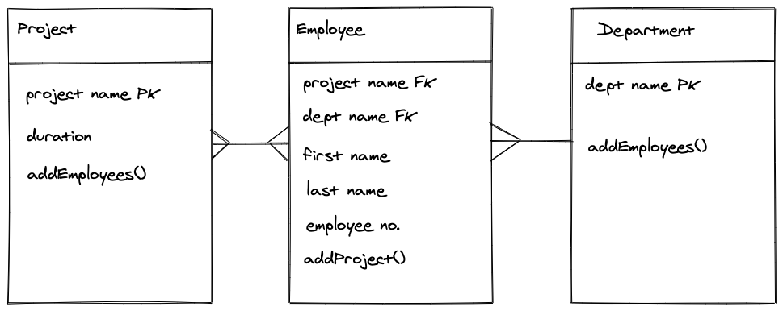

# wk13d2_M2M_Lab

## Task

In this lab, create an application for a company to track their employees, departments and projects.

### MVP

A `Department` must have one-to-many with `Employee`: A `Department` has many `Employee`s. An `Employee` must have a many-to-many with a `Project`: Many `Employee`s can be part of a `Project` and a `Project` can have many different `Employee`s in it.

Implement the following models to achieve the above relationships:

An Employee must:

- have a first name
- have last name
- have an employee number
- be able to be assigned to multiple projects

A Department must:

- have a name
- be able to add multiple employees

A Project must

- have a name
- have a duration in number of days
- be able to add multiple employees

## Planning

Relationship model:

